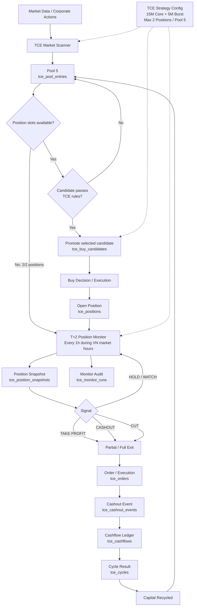

# TCE Flow

## Operating rules

- **Pool:** always maintain up to 5 ranked candidates when capacity is available.
- **Positions:** maximum 2 open positions at the same time.
- **Monitor:** active T+2 positions are monitored every 60 minutes during Vietnam equity market sessions only.
- **When 2/2 positions are open:** skip pool hunting; monitor only.
- **When a position closes:** free the slot and refill Pool 5.
- **Capital:** 15,000,000 VND core capital + up to 5,000,000 VND burst capital.
- **Pool vs execution:** `tce_pool_entries` stores research/scoring intelligence; `tce_buy_candidates` stores only promoted execution candidates.
- **Cashout loop:** position exit → cashout event → cashflow → cycle result → capital recycled into the next opportunity.
